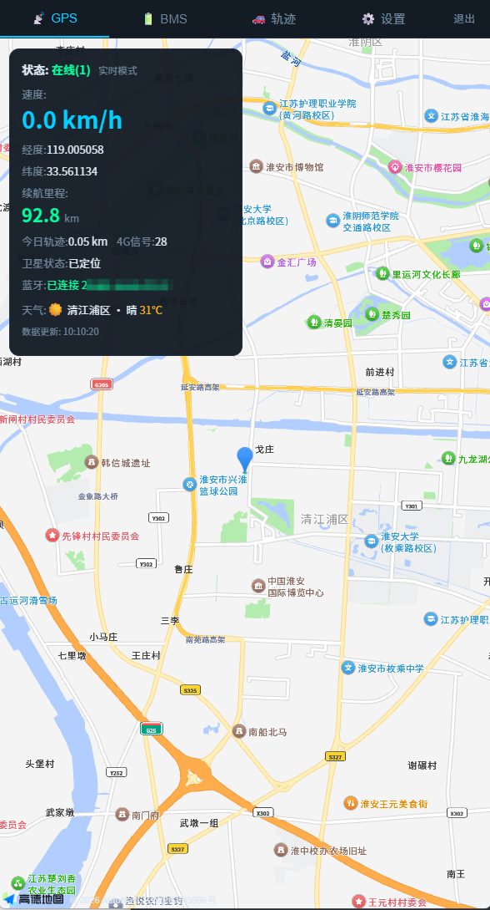
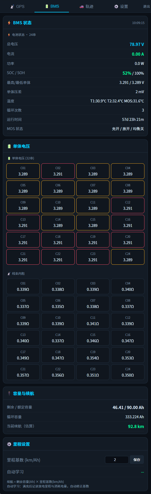
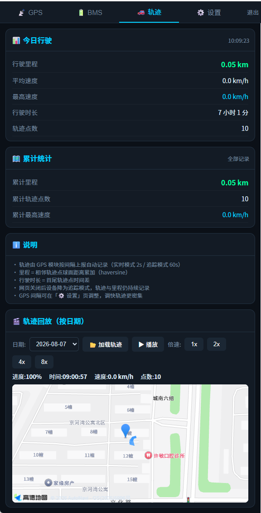
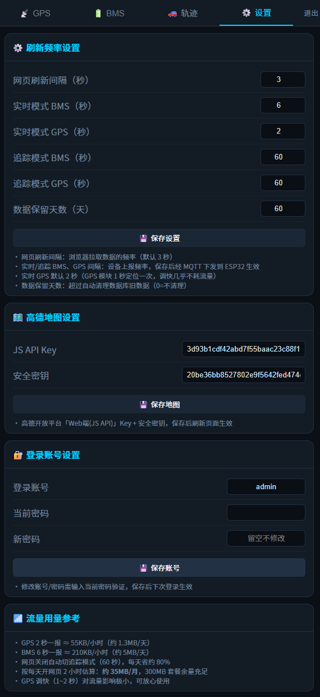

# JK BMS 4G 远程监控系统

用最简单可靠的架构实现锂电池（极空/JK 保护板）BMS 远程监控：

- **ESP32-S3** 通过 BLE 读取极空保护板实时数据，同时可作 BLE 中继（极空 App 可并行接入）
- 经**银尔达 M100PG-DTU（4G + GPS）**通过 MQTT 上传
- **PHP 服务端**（WebHook 架构，无常驻进程，纯虚拟主机即可部署）接收、解析、存储、展示
- 网页打开时 GPS/BMS 实时刷新，关闭后自动降频省流量，轨迹照常记录可回放

<p align="center">
  
  
  
  
</p>

```
极空 BMS ──BLE──> ESP32-S3 ──UART──> 银尔达 M100PG-DTU ──MQTT──> EMQX
  ▲                                                                    │ 规则引擎
  └───── BLE 中继（极空 App 可接入）                                    ▼
                                                              api.php?action=ingest
                                                                   （PHP + SQLite）
                                                              ▲
                                                              └── 网页轮询 / 心跳
```

## 目录结构

```
01-网页服务端/        PHP 服务端（index 看板 / api 接口 / ingest 接收 / parser 解析 /
                    db SQLite / range 里程学习 / login+auth 登录鉴权 / config 配置）
02-ESP32固件/        esp32s3-gateway.ino（Arduino 固件，需 NimBLE-Arduino 库）+ build/ 编译产物
03-参考资料/         第三方参考代码（不随仓库发布）
计划书.md              架构 / 硬件接线 / 上报规则 / 数据流 / 服务端设计（按现状整理）
部署清单.md          部署步骤与自检清单（上传前必读）
```

## 快速开始（服务端）

1. 把 `01-网页服务端/` 全部文件上传到虚拟主机网站根目录（PHP ≥ 7.4，需 `pdo_sqlite` / `curl` / `openssl`）
2. 修改 `config.php`：MQTT 直发凭据（EMQX「客户端认证」账号）/ WebHook token / 登录密码
3. EMQX 控制台建转发规则：`SELECT payload FROM "T"` → HTTP 服务连接器 → `http://你的域名/api.php?action=ingest`，请求头带 `X-Ingest-Token`
4. 浏览器打开网页登录，设备上报后即显示数据

详细步骤见 [`部署清单.md`](部署清单.md)。

## 固件

`02-ESP32固件/esp32s3-gateway.ino`（v2.15，**适配 ESP32-S3 Super Mini 4MB Flash**），Arduino IDE 编译，所需库：
- Arduino-ESP32 Core ≥ 3.0.0
- NimBLE-Arduino ≥ 2.2.2（双 FFE1 必须用 NimBLE，勿用 Bluedroid）
- WebSockets / ArduinoJson

**编译要点（4MB Flash + OTA）**：Tools → Board 选 `ESP32S3 Dev Module`；Partition Scheme 选 **Custom**（用 `02-ESP32固件/partitions.csv` 自定义分区：双 APP 各 1.94MB，支持 OTA）；Flash Size 选 **4MB**；PSRAM 按板子选（Super Mini 一般 OPI）

**固件功能**（BLE 读取+中继基于「中继完整版 v9.3」）：
- **BLE 读取**：帧级转发（完整帧 + CRC 校验通过才转发，坏帧自愈对齐）、帧头双兼容（老版 300B / 新版 ~200B）
- **BLE 中继**：多客户端（最多 5 个）按各自 MTU 分块推送（150B 块模拟真实 BMS）；AT 心跳 / 命令帧回显原样透传
- **兼容性**：特征选择"属性驱动 + handle 优先"，兼容 V20S 双 FFE1（0x03 写/0x05 通知）与 V17/V18/V19 单 FFE1 等其他 handle 布局；订阅按能力选 notify/indicate
- **广播名**：使用中继名称（Web 后台可改、默认 `JK-RELAY`，UTF-8 安全截断 ≤20 字符）
- **GPS 上报**：只看移动/静止（网页开/关一致）——移动 **2s 实时**、静止 ≥60s 停发（30s 本地探测，动即恢复）；速度 ≥3km/h 且位移 ≥30m 双条件判运动（防漂移，阈值常量可调）
- **BMS 上报**：网页打开 **2s 实时**（充/放电/停放一致），网页关闭 **30s**（保里程与续航学习）；电流/电压按串数动态偏移（24S/32S 帧布局自动识别）
- **双模式控制**：下行指令 **MQTT 直连发布**（EMQX 客户端认证账号，TLS 8883），网页开/关自动切换上报频率
- **OTA 固件升级**：Web 后台「固件升级」上传 `.ino.bin` 即可（升级期间保持供电）；首次烧录用 `merged.bin` 全量刷（含 4MB 分区表）
- **OTA 网页升级（v2.14）**：Web 后台「固件升级」上传 `.bin` 直接烧写，成功自动重启、失败自动回滚（4MB Flash 双 OTA 分区，见 `02-ESP32固件/partitions.csv`）
- **BLE 稳定性（v2.15，合入中继完整版 v9.43 全部修复）**：断连后销毁重建客户端防崩溃(FIX-22)、回调内不查 NimBLE API 防崩溃(FIX-23/24)、AT 心跳刷新存活时间防误断(FIX-26)、连接参数放宽抗挤占(FIX-27)、扫描失败退避/不重复启动、MTU 低重试降级、BMS 未连接时中继隐身防抢连、App 命令缓存补发、手动扫描（Web 后台选设备）、WiFi 常开不再自动关闭
- **自愈机制**：卡死看门狗 30s 重启 / DTU 串口无响应 8 分钟重启 / MQTT 下行静默断 12 分钟重启；**重启原因记录**：Web 后台「系统状态」可查上次重启原因（定时重启/看门狗卡死/上电/崩溃），方便诊断

> 编译产物见 `02-ESP32固件/build/`（`esp32s3-gateway.ino.merged.bin` 可直接烧录，该目录不入仓库）

## 服务端功能

- **WebHook 接收**：EMQX 规则转发，无常驻进程，纯虚拟主机可部署
- **网页看板**：GPS 实时定位（高德地图）、BMS 电池详情、单体电压/内阻、续航估算、天气、4G 信号、蓝牙状态
- **轨迹**：按天行程拆分、每日统计（按天查询+全部累计）、地图轨迹回放（1x~8x 倍速动画）
- **里程学习**：随充随学——每次充电结束记录基准，下次充电时用消耗电量与轨迹里程自动修正基数（不要求充满）；学习状态与历史记录在设置页实时显示
- **安全**：登录鉴权（bcrypt + 限速）、内部文件防直接访问、CSRF 防护、data/ 目录保护

## 安全提示

- 仓库中的 `config.php` 已**脱敏为占位符**，部署前必须填入自己的值；**勿把真实账号密码提交到公开仓库**（可用 `git update-index --skip-worktree "01-网页服务端/config.php"` 防止误提交）
- 登录密码请在网页「设置」页修改（bcrypt 哈希存储），登录失败 5 次自动锁定 5 分钟
- 内部 PHP 文件均有防直接访问守卫（需经入口文件加载，Nginx/Apache 均生效）
- 高德 JS API Key 请在开放平台绑定域名白名单

## 协议

仅供学习参考，使用风险自负。
